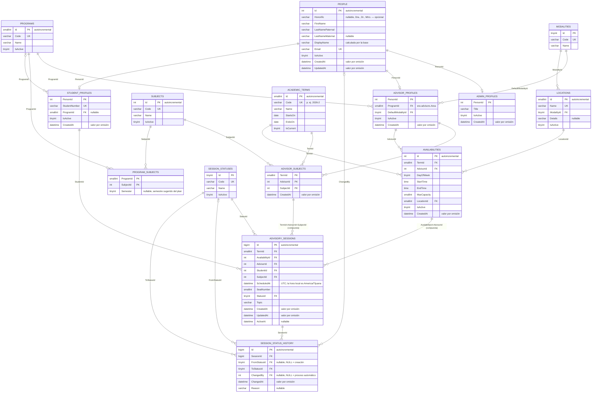

# Diagrama Entidad–Relación

Generado por introspección de `information_schema` sobre la base `fcqi_asesorias` en ejecución, no escrito a mano: refleja la estructura real, no la intención.

**15 tablas · 4 vistas · 23 llaves foráneas · 6 restricciones CHECK · 4 triggers**

Regenerar: `python3 tools/generar-er.py` · última generación 2026-09-21

## Volumen de los datos de prueba

| Tabla | Filas |
|-------|-------|
| `academic_terms` | 1 |
| `admin_profiles` | 1 |
| `advisor_profiles` | 14 |
| `advisor_subjects` | 92 |
| `advisory_sessions` | 6 |
| `availabilities` | 104 |
| `locations` | 2 |
| `modalities` | 2 |
| `people` | 21 |
| `program_subjects` | 57 |
| `programs` | 5 |
| `session_status_history` | 6 |
| `session_statuses` | 4 |
| `student_profiles` | 8 |
| `subjects` | 44 |

## Reglas que impone la base

Estas no dependen del código de la aplicación: valen para cualquier cliente que escriba en la base, incluido un script suelto.

### Llaves foráneas compuestas

- `advisory_sessions(AvailabilityId, AdvisorId)` → `availabilities(Id, AdvisorId)`
- `advisory_sessions(TermId, AdvisorId, SubjectId)` → `advisor_subjects(TermId, AdvisorId, SubjectId)`

### Restricciones CHECK

- `CK_academic_terms_Range`: `(`EndsOn` > `StartsOn`)`
- `CK_availabilities_Capacity`: `(`MaxCapacity` >= 1)`
- `CK_availabilities_DayOfWeek`: `(`DayOfWeek` between 0 and 6)`
- `CK_availabilities_TimeRange`: `(`EndTime` > `StartTime`)`
- `CK_people_InstitutionalEmail`: `((`Email` like _utf8mb4\\'%@uabc.edu.mx\\') and (`Email` = lower(`Email`)))`
- `CK_sessions_Seat`: `(`SeatNumber` >= 1)`

### Triggers

- `TRG_sessions_before_insert` — BEFORE INSERT en `advisory_sessions`
- `TRG_sessions_before_update` — BEFORE UPDATE en `advisory_sessions`
- `TRG_sessions_history_insert` — AFTER INSERT en `advisory_sessions`
- `TRG_sessions_history_update` — AFTER UPDATE en `advisory_sessions`

### Vistas

- `v_advisors`
- `v_availability_load`
- `v_person_roles`
- `v_students`

## Cómo leer las relaciones clave

**Una persona, varios roles.** `PEOPLE` se relaciona con los tres perfiles como
`||--o|`: cero o un perfil de cada tipo, y los tres a la vez si hace falta. Es
lo que permite que un alumno sea también asesor —los asesores pares del
programa— sin duplicar su identidad. El modelo anterior tenía tres tablas de
identidad separadas y el rol lo decidía el orden de los `SELECT`, así que esa
persona quedaba atrapada en uno solo.

**`ADVISORY_SESSIONS` cuelga de dos llaves foráneas compuestas**, y no son
adorno:

- `(AvailabilityId, AdvisorId)` → `AVAILABILITIES (Id, AdvisorId)` hace
  imposible que una sesión declare un asesor distinto al dueño del horario.
- `(TermId, AdvisorId, SubjectId)` → `ADVISOR_SUBJECTS` impide agendar una
  materia que ese asesor no imparte en ese ciclo.

Ambas reglas existían antes solo como `if` en C#, de modo que cualquier
`INSERT` por SQL podía saltárselas.

**`ActiveAt` es el mecanismo de cupo.** Vale la fecha mientras la sesión ocupa
lugar y `NULL` cuando se cancela o se rechaza. Como los `NULL` no colisionan en
un índice único, cancelar libera el asiento sin borrar la fila ni perder el
historial. La mantienen los triggers, no la aplicación.

**`LOCATIONS` absorbe la modalidad.** Antes `availabilities` guardaba
`Modality` y `Location` por separado, y el valor `'Enlace virtual (Meet/Teams)'`
implicaba modalidad virtual: una dependencia transitiva. Ahora la sede declara
su modalidad una sola vez.

**Todo cuelga de un ciclo.** `ACADEMIC_TERMS` aparece en `ADVISOR_SUBJECTS`,
`AVAILABILITIES` y `ADVISORY_SESSIONS`. Antes el ciclo era la cadena
`'FCQI 2026-2'` repetida en las 44 materias, y reasignar borraba el historial
del semestre anterior.

## Lo que el diagrama no dice

El cupo (`MaxCapacity`) se respeta con índices únicos sobre `ActiveAt` más un
trigger que compara el asiento contra el cupo del bloque; un `CHECK` no habría
podido, porque no puede consultar otra tabla.

Que `ScheduledAt` caiga en el día y la hora del bloque **no** lo valida la
base: comprobarlo exige `CONVERT_TZ` entre UTC y `America/Tijuana`, y esa
validación vive en `CreateSessionCommandHandler`, donde la zona horaria es
explícita.

Quién puede ver o modificar cada asesoría tampoco está aquí: son reglas de
autorización, y viven en la capa de aplicación.

